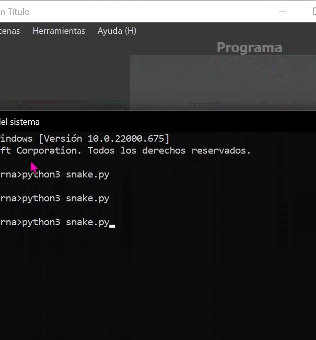

# Carlos Fernando Ramos Mena A01197622

## Autor:
- Carlos Fernando Ramos Mena

##Funciones Agregadas
### def foodMove()
  - Controla Movimiento de la comida
  - Autor: Carlos Fernando Ramos Mena
  - Código:
    ```python
      def foodMove():
        rNumber = randrange(1,5)

        if rNumber == 1 and inside(vector(food.x+10,food.y)):
            food.x = food.x + 10        
        if rNumber == 2 and inside(vector(food.x-10,food.y)):
            food.x = food.x - 10    
        if rNumber == 3 and inside(vector(food.x,food.y+10)):
            food.y = food.y + 10
        if rNumber == 4 and inside(vector(food.x,food.y-10)):
            food.y = food.y - 10
    ```
### def info_alumnos()
- Muestra la información del alumno
- Autor: Carlos Fernando Ramos Mena
- Código:
  ```python
    def info_alumnos():
      writer.hideturtle()
      writer.up()
      writer.goto(-100,190)
      writer.color("blue")
      writer.write("Carlos Ramos A01197622",align='left')
  ```
## Actualización de funciones:
### def move()
- Se corrigió bug que hacia la comida aparecer dentro de la serpiente
- Se corrigió bug que hacia la comida moverse dentro de la serpiente
- Autor: Carlos Fernando Ramos Mena
- Código:
```python
  if head == food or food in snake:
          print('Snake:', len(snake))
          y=randrange(-15, 15) * 10;
          x=randrange(-15, 15) * 10;
          while vector(x,y)in snake:
              y=randrange(-15, 15) * 10;
              x=randrange(-15, 15) * 10;
          food.x = x
          food.y = y    
  ```

## Actualización de código principal:
- Se creo lista de colores para que la serpiente y la comida iniciaran de diferente color cada vez
- Autor: Carlos Fernando Ramos Mena
- Código:
```python
      writer=Turtle()
      colors=["#F8FF33","#BEFF33","#5CFF33","#33FFF1","#3381FF","#5833FF","#DD33FF","#FF33AD","#FF33AD","#F8990B"]
      colorB=colors[randrange(0,10)]
      colorF=colors[randrange(0,10)]
      while colorB == colorF:
          colorF=colors[randrange(0,10)]
                food.y = y    
  ```
  ###GIF
  
